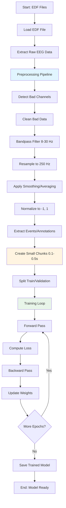
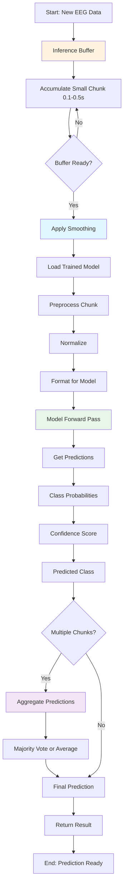
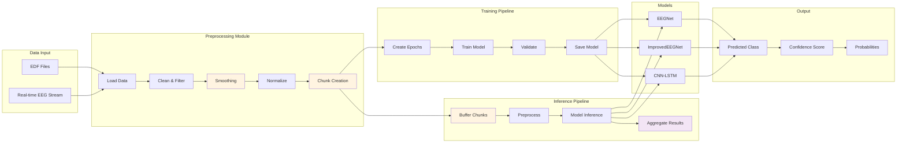

# EDF Prosthetic Research - Pipeline Flowchart

This document shows the flow of data and processing steps in the EDF prosthetic research pipeline.

## Training Pipeline



## Inference Pipeline



## Complete System Architecture



## Key Processing Steps

### 1. Data Loading
- **Input**: EDF files with EEG signals
- **Output**: Raw MNE Raw objects
- **Location**: `src/edf_ml_model/data_utils.py`, `scripts/train_*.py`

### 2. Preprocessing
- **Steps**:
  1. Detect and clean bad channels
  2. Apply bandpass filter (8-30 Hz)
  3. Resample to target frequency (250 Hz)
  4. **Apply smoothing/averaging** (NEW)
  5. Normalize to [-1, 1]
- **Location**: `src/edf_ml_model/preprocessing.py`

### 3. Chunk Creation
- **Method**: Create small chunks (0.1s to 0.5s) from continuous data
- **For Training**: Extract chunks around event markers
- **For Inference**: Sliding window chunks from continuous stream
- **Location**: `src/edf_ml_model/preprocessing.py::create_sliding_chunks()`

### 4. Model Training
- **Input**: Chunks with labels
- **Process**: Forward pass, loss computation, backpropagation
- **Output**: Trained model weights
- **Location**: `scripts/train_improved_model.py`, `src/edf_ml_model/model.py`

### 5. Model Inference
- **Input**: Small chunk of EEG data (0.1-0.5s)
- **Process**: 
  1. Apply smoothing
  2. Normalize
  3. Forward pass through model
  4. Aggregate if multiple chunks
- **Output**: Predicted class, confidence, probabilities
- **Location**: `src/edf_ml_model/inference.py`

## Data Flow Summary

```
EDF File → Raw Data → Preprocessing → Small Chunks (0.1-0.5s) → Model → Prediction
                ↓
         [Smoothing Applied]
                ↓
         [Normalization]
                ↓
         [Chunk Creation]
```

## Key Improvements (Latest Updates)

1. **Small Chunk Processing**: Changed from 30-second buffers to 0.1-0.5s chunks for faster, more responsive processing
2. **Smoothing/Averaging**: Added moving average smoothing to reduce noise before neural network processing
3. **Configurable Parameters**: Chunk size and smoothing can be configured via command-line arguments

## Component Interactions

- **Preprocessing** ↔ **Training**: Preprocessing prepares data for training
- **Preprocessing** ↔ **Inference**: Same preprocessing applied to inference data
- **Model** ↔ **Training**: Model is trained on preprocessed chunks
- **Model** ↔ **Inference**: Trained model processes inference chunks
- **Inference Buffer** ↔ **Chunk Creation**: Buffer accumulates data into chunks

## API Server Flow

```
Client Request → API Server → Load Model → Preprocess Data → 
Inference → Aggregate Results → Return Prediction
```

See `docs/EEG_API_README.md` for API details.
